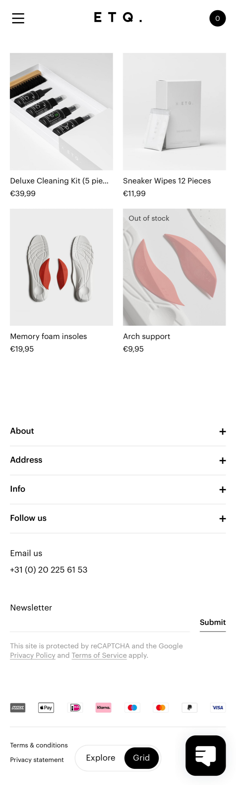

# Procesverslag
Markdown is een simpele manier om HTML te schrijven.  
Markdown cheat cheet: [Hulp bij het schrijven van Markdown](https://github.com/adam-p/markdown-here/wiki/Markdown-Cheatsheet).

Nb. De standaardstructuur en de spartaanse opmaak van de README.md zijn helemaal prima. Het gaat om de inhoud van je procesverslag. Besteedt de tijd voor pracht en praal aan je website.

Nb. Door *open* toe te voegen aan een *details* element kun je deze standaard open zetten. Fijn om dat steeds voor de relevante stuk(ken) te doen.

## Jij

uitwerken voor kick-off werkgroep

### Auteur:
Nina Vens

#### Je startniveau:
Rood

#### Je focus:
Responsive
 

## Je website

uitwerken voor kick-off werkgroep

### Je opdracht:
https://www.etq-amsterdam.com

#### Screenshot(s) van de eerste pagina (small screen): 
homepage

#### Screenshot(s) van de tweede pagina (small screen):
shoecare

 

## Breakdownschets (week 1)

uitwerken na afloop 2e werkgroep

### de hele pagina: 

## Voortgang 1 (week 2)

uitwerken voor 1e voortgang

### Stand van zaken
Als ik eenmaal begin met coderen/programmeren pak ik het weer snel op.
-
Stand van zaken:
- homepagina is af (responsive en wel)
- nu verder met de tweede pagina

### Agenda voor meeting
samen met je groepje opstellen

| Nina (ik)      | Mick               | Sarah            | 
| ---            | ---                | ---              | 
| x              | Uitlijnen tekst in | ?                | 
|                | de hoogte          |                  | 
|                |                    |                  | 

### Verslag van meeting
hier na afloop snel de uitkomsten van de meeting vastleggen

- loop prima op schema
- op school werken kan ook
- handig om met wat studenten samen wat te doen
- 1 + 1 = 3

## Voortgang 2 (week 3)

uitwerken voor 2e voortgang

### Stand van zaken
hier dit ging goed & dit was lastig (neem ook screenshots op van delen van je website en code)

### Agenda voor meeting
samen met je groepje opstellen

| student 1      | student 2          | student 3    | student 4        |
| ---            | ---                | ---          | ---              |
| dit bespreken  | en dit             | en ik dit    | en dan ik dat    |
| en dat ook nog | dit als er tijd is | nog een punt | dit wil ik zeker |
| ...            | ...                | ...          | ...              |

### Verslag van meeting
hier na afloop snel de uitkomsten van de meeting vastleggen

- punt 1
- punt 2
- nog een punt
- ...

## Toegankelijkheidstest (week 4)

uitwerken na test in 8e voortgang

### Bevindingen
Lijst met je bevindingen die in de test naar voren kwamen:

#### Titel eerste bevinding
Hier korte omschrijving (met indien nodig een afbeelding)

Hier een omschrijving van hoe het opgelost kan worden (met indien nodig een afbeelding)

#### Titel tweede bevinding. 
Hier korte omschrijving (met indien nodig een afbeelding)

Hier een omschrijving van hoe het opgelost kan worden (met indien nodig een afbeelding)

#### Titel volgende bevinding. 
Hier korte omschrijving (met indien nodig een afbeelding)

Hier een omschrijving van hoe het opgelost kan worden (met indien nodig een afbeelding)

#### Titel nog een bevinding. 
Hier korte omschrijving (met indien nodig een afbeelding)

Hier een omschrijving van hoe het opgelost kan worden (met indien nodig een afbeelding)

## Voortgang 3 (week 4)

uitwerken voor 3e voortgang

### Stand van zaken
hier dit ging goed & dit was lastig (neem ook screenshots op van delen van je website en code)

### Agenda voor meeting
samen met je groepje opstellen

| student 1      | student 2          | student 3    | student 4        |
| ---            | ---                | ---          | ---              |
| dit bespreken  | en dit             | en ik dit    | en dan ik dat    |
| en dat ook nog | dit als er tijd is | nog een punt | dit wil ik zeker |
| ...            | ...                | ...          | ...              |

### Verslag van meeting
hier na afloop snel de uitkomsten van de meeting vastleggen

- punt 1
- punt 2
- nog een punt
- ...

 

## Eindgesprek (week 5)

uitwerken voor eindgesprek

### Stand van zaken
hier dit ging goed & dit was lastig (neem ook screenshots op van delen van je website en code)

### Screenshot(s)

hier screenshot(s) van je eindresultaat

 

## Bronnenlijst

### Html
1. svg tag: https://developer.mozilla.org/en-US/docs/Web/SVG/Element/svg
2. ...
3. ...

### CSS
1. user-select: https://developer.mozilla.org/en-US/docs/Web/CSS/user-select
2. mirror items: https://stackoverflow.com/questions/5406368/can-you-use-css-to-mirror-flip-text
3. multiple transforms: https://stackoverflow.com/questions/10765755/how-to-apply-multiple-transforms-in-css

### Javascript
1. getElementsByTagName: https://stackoverflow.com/questions/17349081/change-style-of-all-elements-using-getelementsbytagname
2. detect screen width: https://stackoverflow.com/questions/31162606/how-to-detect-screen-size-for-responsive-web-design
3. reload after resize: https://stackoverflow.com/questions/14915653/refresh-page-on-resize-with-javascript-or-jquery
4. addEventListener 'mouseout': https://developer.mozilla.org/en-US/docs/Web/API/Element/mouseout_event

